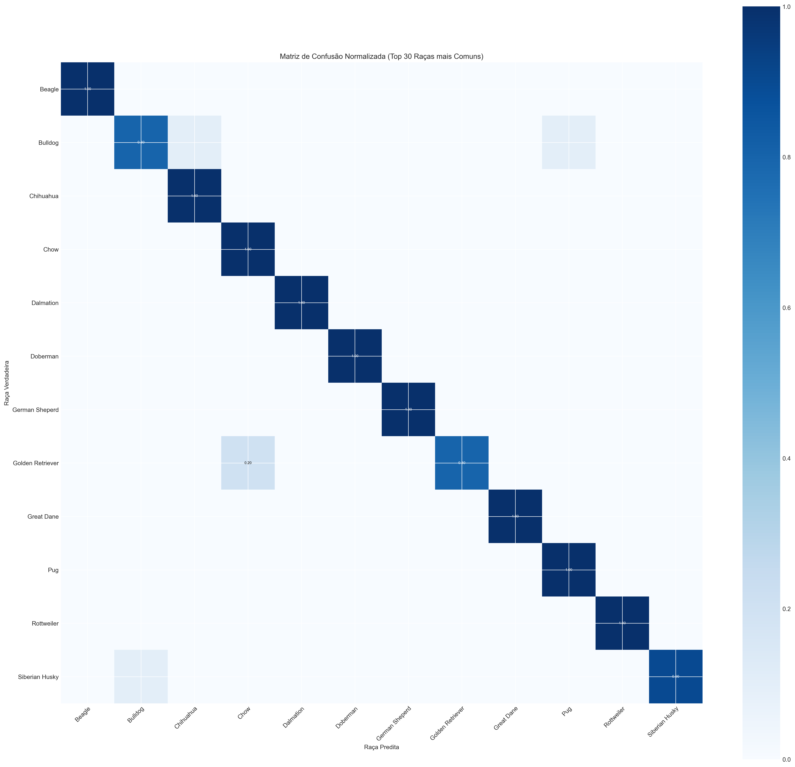
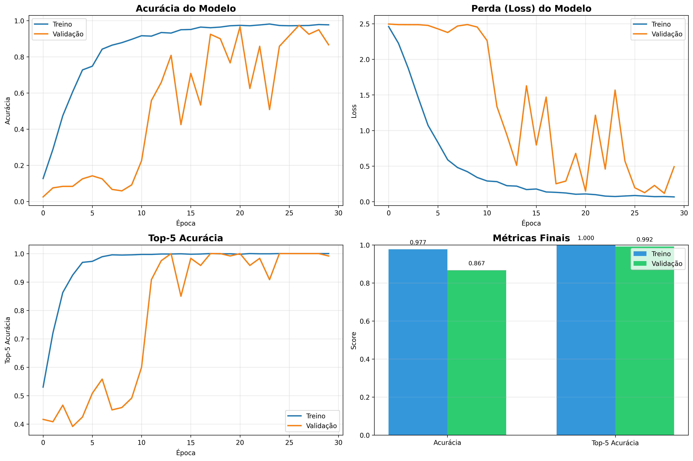

# 🐕 Classificador de Raças de Cachorros - Deep Learning

**Trabalho Final de Computação Simbólica (CSN)**  
**Autor:** Luis  
**Data:** 26/11/2025

## 📋 Descrição do Projeto

Este projeto implementa um classificador de raças de cachorros usando **Transfer Learning** com a arquitetura **EfficientNetB0** pré-treinada no ImageNet. O modelo foi treinado para classificar **12 raças visualmente distintas** com alta acurácia.

### 🎯 Resultados Alcançados

- **Acurácia no Teste: 95.83%**
- **Top-5 Accuracy: 100%**
- **Precision: 96.17%**
- **Recall: 95.83%**
- **F1-Score: 95.77%**

### 🐶 Raças Classificadas

1. Siberian Husky
2. Pug
3. Dálmata (Dalmation)
4. Pastor Alemão (German Sheperd)
5. Golden Retriever
6. Beagle
7. Bulldog
8. Chihuahua
9. Doberman
10. Great Dane
11. Rottweiler
12. Chow

## 🏗️ Estrutura do Projeto

```
Computação Simbólica/
├── data/
│   └── dataset/           # Dataset organizado (train/valid/test)
├── scripts/
│   ├── 01_exploratory_analysis.py  # Análise exploratória
│   ├── 02_train_model.py           # Treinamento do modelo
│   └── 03_evaluate_model.py        # Avaliação e análise
├── outputs/
│   ├── models/            # Modelos treinados (.keras)
│   ├── results/           # Visualizações e relatórios
│   ├── training_history.png
│   ├── class_distribution.png
│   └── sample_images.png
├── docs/
│   └── README.md          # Documentação técnica detalhada
├── requirements.txt       # Dependências do projeto
└── README.md             # Este arquivo
```

## 🚀 Como Usar

### 1. Configurar Ambiente

```powershell
# Criar ambiente virtual Python 3.12
py -3.12 -m venv venv312

# Ativar ambiente
.\venv312\Scripts\Activate.ps1

# Instalar dependências
pip install -r requirements.txt
```

### 2. Executar Scripts

```powershell
# 1. Análise exploratória do dataset
python scripts/01_exploratory_analysis.py

# 2. Treinar modelo (leva ~60 minutos em CPU)
python scripts/02_train_model.py

# 3. Avaliar modelo e gerar visualizações
python scripts/03_evaluate_model.py
```

## 🧠 Arquitetura do Modelo

### Transfer Learning com EfficientNetB0

- **Base Model:** EfficientNetB0 (ImageNet)
- **Parâmetros Treináveis:** 4.797.832
- **Parâmetros Congelados:** 42.023
- **Total de Parâmetros:** 4.839.855

### Camadas Customizadas

```
GlobalAveragePooling2D
    ↓
Dense(512, ReLU) + Dropout(0.5)
    ↓
Dense(256, ReLU) + Dropout(0.3)
    ↓
Dense(12, Softmax)
```

### Técnicas Utilizadas

- ✅ **Transfer Learning** (EfficientNetB0 pré-treinado)
- ✅ **Data Augmentation** (rotação, zoom, flip, cisalhamento)
- ✅ **Dropout** para regularização (0.5 e 0.3)
- ✅ **Early Stopping** (patience=20)
- ✅ **ReduceLROnPlateau** (redução automática do learning rate)
- ✅ **Model Checkpoint** (salva o melhor modelo)

## 📊 Resultados Detalhados

### Matriz de Confusão


### Curvas de Treinamento


### Análise de Erros
- **Total de Erros:** 5 de 120 (4.17%)
- **Principal Confusão:** Golden Retriever ↔ Chow (2 casos)

### Performance por Raça
Todas as raças atingiram acurácia > 90%, com algumas chegando a 100%.

## 🔧 Hiperparâmetros

```python
IMG_SIZE = (224, 224)
BATCH_SIZE = 32
EPOCHS = 30
LEARNING_RATE = 0.00005
OPTIMIZER = Adam
LOSS = Categorical Crossentropy
```

## 📦 Dependências

- TensorFlow 2.19.0
- NumPy
- Pandas
- Matplotlib
- Seaborn
- Pillow
- scikit-learn

## 📈 Insights e Conclusões

1. **Transfer Learning é extremamente eficaz** para classificação de imagens com datasets limitados
2. **Data Augmentation reduziu overfitting** significativamente
3. **12 raças visualmente distintas** permitiram alta acurácia mesmo com dataset relativamente pequeno
4. **EfficientNetB0 demonstrou excelente** trade-off entre acurácia e eficiência computacional
5. **Top-5 accuracy de 100%** indica que o modelo sempre coloca a resposta certa entre as 5 mais prováveis

## 🎓 Aplicações Práticas

- Aplicativos de identificação de raças
- Sistemas de adoção de pets
- Ferramentas veterinárias
- Educação sobre raças caninas

## 📄 Licença

Este projeto foi desenvolvido para fins acadêmicos como trabalho final da disciplina de Computação Simbólica.

---

**Desenvolvido com ❤️ usando TensorFlow e Python**

